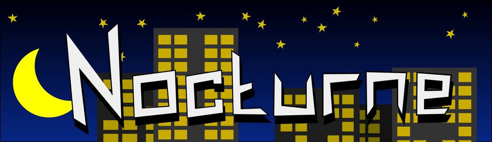

# NocturneOS

NocturneOS - это форк операционной системы SayoriOS.


Простая операционная система для компьютеров на архитектуре x86. Написана на языках Ассемблер, C и Rust.

* [Канал с обновлениями в Telegram](https://t.me/ndraey_ch)

## Цели

Миниатюрная экспериментальная операционная система с графическим интерфейсом пользователя, защитой памяти и набором инструментов для системной и прикладной разработки изнутри ОС.

## Зачем?

АХТУНГ: Этот проект НЕ стремится заменить уже существующие ОС.

Этот проект разрабатывается для:

- Изучение низкоуровнего программирования и OSDEV
- Чисто поугарать
- Рубрика ЭЭЭЭЭЭЭЭЭЭЭЭКСПЕРИМЕНТЫ (отсылка к Галилео)

## Скриншоты

Скоро будут)

## Системные требования

Ядро не требует много ресурсов:
- Процессор: x86_32 или x86_64 (1 ядро; 1 ГГц)
- ОЗУ: 64 МБ
- Жесткий диск: необязательно
- COM-порты: необязательно
- Floopy-привод: необязательно
- Видеоадаптер: 4 MB+

## Компоненты
- Ядро
  - Менеджер памяти (виртуальная память, куча ядра)
  - Работа с CMOS (позволяет получать время)
  - Базовые библиотеки (основа для расширения функционала ядра)
  - Потоки
  - Процессы
  - Работа с PCI
- Драйвера
  - Клавиатура PS/2
  - Мышь PS/2
  - Пищалка (Buzzer, PC Speaker)
  - Realek RTL-8139 (Драйвер для работы с сетью)
- Файлы и папки
  - Виртуальная файловая система
  - TarFS
  - NoctFS
  - FAT32 (RO)
- Сеть
  - ARP
  - UDP
  - DHCP
- Прочие
  - Программы ELF32 (Поддержка и запуск в ядре)
  - Определение процессора (Получение информации о процессоре)
  - Поддержка FPU (Для работы чисел с плавающей точкой)
  - Поддержка UEFI

## Сборка

Для написания программ под NocturneOS может потребоваться SayoriSDK: https://github.com/NDRAEY/NocturneSDK

Для компиляции вам потребуется операционная система на базе ядра Linux или Windows (с WSL), в которой предустановлено ПО для разработки.Установить можно следующей командой:

```bash
sudo apt-get install python3 gcc cmake ninja-build xorriso mtools
```

Система содержит мрдули написанные на языке программирования Rust, поэтому требуется установить компилятор Rust.

Вы можете использовать компилятор из репозитория вашего дистрибутива, но рекомендуется использовать классический способ установки Rust:
```bash
curl https://sh.rustup.rs -sSf | sh
```

На данный момент используется версия Rust 1.87, для этого устанваливаем эту версию через rustup (+ исходники для компиляции std):
```bash
rustup toolchain install nightly-2025-04-01
rustup component add rust-src --toolchain nightly-2025-04-01-x86_64-unknown-linux-gnu
```

Если вы планируете запускать эту систему в виртуальной машине, то ещё нужно установить QEMU:

```bash
sudo apt-get install qemu-system-x86 qemu-tools
```

Клонируем репозиторий:

```bash
git clone https://github.com/NDRAEY/NocturneOS-base NocturneOS
```

Переходим к папке:

```bash
cd NocturneOS
```

Собираем конфигурацию с отладочной информацией:

```bash
cmake -B cmake-build-debug -G Ninja . -DCMAKE_BUILD_TYPE=Debug
```

Компилируем и запускаем:

```bash
cmake --build cmake-build-debug/ -j4 -- run
```

Также `run` можно заменить на `iso` чтобы просто собрать образ.

## <a id="contibution">Вклад в проект</a>

Мы рады новым разработчикам и пользователям NocturneOS! Есть несколько способов, которыми вы можете внести свой вклад в проект:

### <a id="developers">Если вы разработчик</a>

Если вы разработчик, вы можете помочь, добавляя новые функции, устраняя ошибки или улучшая существующий код. Для этого вам нужно сделать следующее:

- Скачайте репозиторий проекта на свой локальный компьютер.
- Создайте новую ветку для вашей работы.
- Внесите изменения и фиксируйте их с использованием Git.
- Отправьте запрос на объединение (Pull Request) в основную ветку проекта.

Мы будем рады вашим вкладам и готовы рассмотреть ваши Pull Request'ы.

### <a id="testers">Если вы тестировщик</a>

Если вы нашли ошибку в проекте или у вас есть предложения по улучшению, пожалуйста, создайте новый Issue в репозитории проекта. Опишите проблему или предложение подробно, чтобы мы могли понять и рассмотреть их.

Еще одним способом помочь проекту является тестирование. Вы можете протестировать новые функции, исправления ошибок и сообщить о найденных проблемах.

Последний релиз: https://github.com/pimnik98/SayoriOS/releases

### <a id="adv">Пиар</a>

Если вы готовы сделать обзор ОС или написать о ней где-нибудь, пожалуйста свяжитесь с координационной группой проекта.

## <a id="legalinfo">Правовая информаиция<a/>

### <a id="denialofresponsibility">Отказ от отвественности</a>

NocturneOS это не дистрибутив Linux, это совершенно-новый проект который не имеет за собой компании или организации которая могла бы дать гарантий.

Ядро NocturneOS имеет открытый исходный код, вы можете сами удостовериться в отсутствии вредоносного ПО изучая файлы этого репозитория.

При использовании материалов вы обязуетесь соблюдать авторские права.

Участники проекта не несут ответственности за причиненный ущерб возникший в результате использования проекта. Используйте на свой страх и риск.

Запуск ядра возможен на реальном оборудовании, были тесты и на некоторых устройствах оно реально запустилось, хоть и с ограничениями

## <a id="contributors">Благодарности</a>

* [Никита Пиминов](https://github.com/pimnik98) (Создатель SayoriOS)
* [Михаил Глухов](https://github.com/rigidus) (README)
